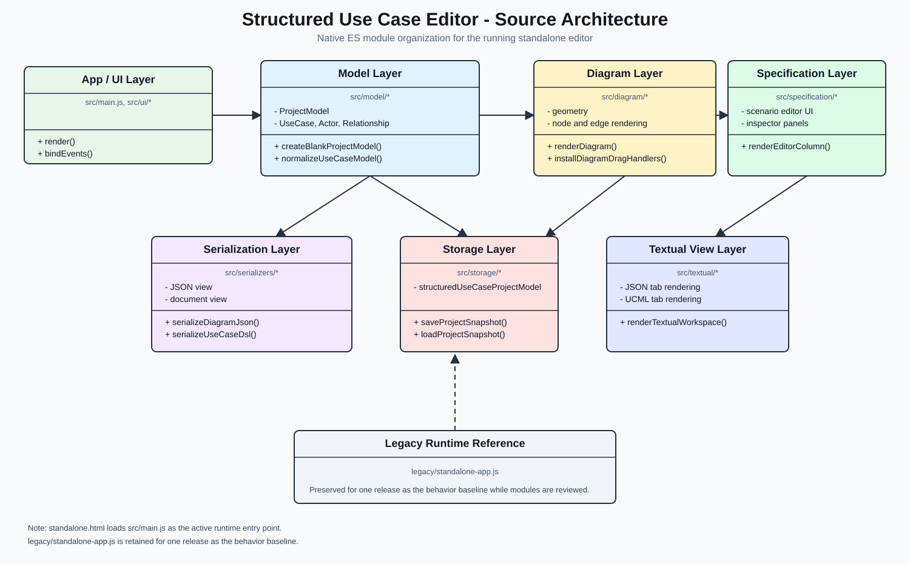

# Architecture

This document describes the modular structure for the Structured Use Case Editor.

The application runs from `standalone.html`, which loads `src/main.js` as a native ES module. The previous one-file implementation is preserved in `legacy/standalone-app.js` as the behavior baseline for one release.

## Module Responsibilities

### Application Layer

- `src/main.js` is the active ES module entry point.
- `src/app/appController.js` coordinates startup state, persistence loading, and the first render.
- `src/app/state.js` contains shared application state used by the module tree.
- `src/ui/appRenderer.js` contains top-level workspace rendering functions.
- `src/ui/eventBinding.js` contains application event binding.
- `src/ui/dom.js` contains small DOM/string rendering helpers.

### Model Layer

- `src/model/factories.js` creates example and blank use case models.
- `src/model/constants.js` contains diagram and relationship constants.
- `src/model/normalize.js` normalizes model shape and legacy diagram forms.
- `src/model/selectors.js` locates selected nodes, relationships, and scenarios.
- `src/model/scenarioOperations.js` mutates scenarios and steps.

### Diagram Layer

- `src/diagram/geometry.js` calculates diagram points and node boundaries.
- `src/diagram/diagramRenderer.js` renders actors, use cases, and relationships.
- `src/diagram/diagramInteractions.js` handles diagram editing gestures.

### Specification Layer

- `src/specification/specificationRenderer.js` renders the structured specification editor.

### Serialization Layer

- `src/serializers/jsonSerializer.js` serializes the editor model as JSON.
- `src/serializers/documentSerializer.js` renders the document-oriented use case view.
- `src/serializers/ucmlSerializer.js` renders UCML textual notation.

### Persistence Layer

- `src/storage/storageService.js` persists the editor model in browser `localStorage`.

## Status

The active runtime is the modular ES module implementation under `src/`. `src/app/appController.js` is intentionally small and coordinates the application startup while model operations, diagram behavior, specification rendering, serialization, persistence, textual rendering, and event binding live in their respective modules.

`legacy/standalone-app.js` is retained unchanged for one release as a behavior reference.
